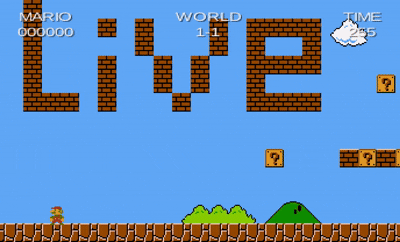

# SuperMario-Clone

A 2D side-scrolling platformer built with [libGDX](https://libgdx.com/) that recreates the core gameplay of the original _Super Mario Bros._ (NES). Control Mario through a faithful recreation of World 1-1.

## Features

- **Physics-driven movement** — Box2D-based platforming with acceleration, jumping, and collision
- **Enemies** — Goombas and Koopa Troopas with stomp, shell-kick, and chain-reaction mechanics
- **Power-ups** — Super Mushroom that makes Mario big (double height, brick-smashing, extra hit point)
- **Fireballs** — Projectiles that bounce off surfaces and destroy enemies
- **Interactive tiles** — Coin blocks, question blocks (with hidden mushrooms), and smashable bricks
- **HUD** — Score counter, world indicator, and 300-second countdown timer
- **Game Over** — Death animation with game-over screen (click to restart)
- **Camera** — Horizontally follows Mario, clamped to map boundaries

## Gameplay Video



## Controls

| Key   | Action                  |
| ----- | ----------------------- |
| ← / → | Move Mario left / right |
| ↑     | Jump                    |
| Space | Fire a fireball         |

On the Game Over screen, click anywhere to restart.

## Quick Start

```bash
# Run the game
./gradlew lwjgl3:run

# Build a runnable JAR
./gradlew lwjgl3:jar
# JAR is at lwjgl3/build/libs/

# Run all checks
./gradlew build
```

## Project Structure

```
core/src/main/java/com/arjkre/SuperMarioClone/
├── Main.java                     # Game entry point, constants, asset loading
├── Scenes/
│   └── Hud.java                  # In-game HUD (score, time, world)
├── Screens/
│   ├── PlayScreen.java           # Main gameplay screen
│   └── GameOverScreen.java       # Game over overlay
├── Sprites/
│   ├── Mario.java                # Player character with animations and states
│   ├── Enemies/
│   │   ├── Enemy.java            # Abstract enemy base
│   │   ├── Goomba.java           # Goomba enemy
│   │   └── Turtle.java           # Koopa Troopa enemy
│   ├── Items/
│   │   ├── Item.java             # Abstract item base
│   │   ├── ItemDef.java          # Item spawn definition
│   │   └── Mushroom.java         # Super Mushroom power-up
│   ├── Other/
│   │   └── FireBall.java         # Fireball projectile
│   └── TileObjects/
│       ├── InteractiveTileObject.java  # Abstract tile base
│       ├── Coin.java              # Coin / question block
│       └── Brick.java             # Breakable brick
└── Tools/
    ├── B2WorldCreator.java        # Parses Tiled map → Box2D world
    └── WorldContactListener.java  # Collision handling
```

## Technologies

- **[libGDX](https://libgdx.com/) 1.13.1** — Cross-platform game framework
- **[Box2D](https://box2d.org/)** — 2D physics engine
- **[LWJGL3](https://www.lwjgl.org/)** — Desktop backend
- **[Gradle](https://gradle.org/)** — Build system (wrapper included)
- **[Tiled](https://www.mapeditor.org/)** — Level editor (`.tmx` maps)
- **Java 21** — Language and toolchain

## Building

This project uses the Gradle wrapper. Useful commands:

| Command                | Task                            |
| ---------------------- | ------------------------------- |
| `./gradlew lwjgl3:run` | Start the game                  |
| `./gradlew lwjgl3:jar` | Build a runnable JAR            |
| `./gradlew build`      | Build all modules               |
| `./gradlew clean`      | Remove build folders            |
| `./gradlew --continue` | Don't stop on errors            |
| `./gradlew --daemon`   | Use Gradle daemon               |
| `./gradlew --offline`  | Use cached dependencies         |
| `./gradlew idea`       | Generate IntelliJ project files |
| `./gradlew eclipse`    | Generate Eclipse project files  |

=======
A [libGDX](https://libgdx.com/) project generated with [gdx-liftoff](https://github.com/libgdx/gdx-liftoff).

This project was generated with a template including simple application launchers and a main class extending `Game` that sets the first screen.

## Platforms

- `core`: Main module with the application logic shared by all platforms.
- `lwjgl3`: Primary desktop platform using LWJGL3; was called 'desktop' in older docs.

## Gradle

This project uses [Gradle](https://gradle.org/) to manage dependencies.
The Gradle wrapper was included, so you can run Gradle tasks using `gradlew.bat` or `./gradlew` commands.
Useful Gradle tasks and flags:

- `--continue`: when using this flag, errors will not stop the tasks from running.
- `--daemon`: thanks to this flag, Gradle daemon will be used to run chosen tasks.
- `--offline`: when using this flag, cached dependency archives will be used.
- `--refresh-dependencies`: this flag forces validation of all dependencies. Useful for snapshot versions.
- `build`: builds sources and archives of every project.
- `cleanEclipse`: removes Eclipse project data.
- `cleanIdea`: removes IntelliJ project data.
- `clean`: removes `build` folders, which store compiled classes and built archives.
- `eclipse`: generates Eclipse project data.
- `idea`: generates IntelliJ project data.
- `lwjgl3:jar`: builds application's runnable jar, which can be found at `lwjgl3/build/libs`.
- `lwjgl3:run`: starts the application.
- `test`: runs unit tests (if any).

Note that most tasks that are not specific to a single project can be run with `name:` prefix, where the `name` should be replaced with the ID of a specific project.
For example, `core:clean` removes `build` folder only from the `core` project.
